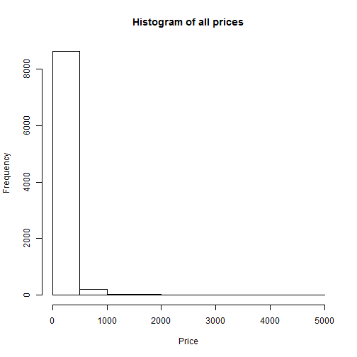
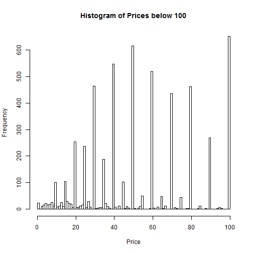

<style>
.midcenter {
    position: fixed;
    top: 50%;
    left: 50%;
}
.small-code pre code {
  font-size: 1em;
}

.big {
  font-size: 10em;
}
</style>


Welcome to BT1101.1
========================================================
author: 
date: 

Introductions Are In Order
========================================================
transition: fade
incremental: true

- Ken Oung
- Jun Weng
- Zhen Xuan
- Jin Wei
- Rhynade
- Selina
- Jian Sheng

Business Analytics
========================================================
transition: fade
incremental: true
- Descriptive Analytics
- Predictive Analytics
- Prescriptive Analytics

What To Expect
========================================================
transition: fade
incremental: true

- RStudio Basics
- Data Management
- Data Visualization
- Linear Regression

You're on your own for these
========================================================
transition: fade
incremental: true

- Statistical Analysis
- Logistic Regression
- Excel

Getting Started
========================================================
transition: fade
title: false

<div class="midcenter" style="margin-left:-112.5px; margin-top:-112.5px;">
</img>
</div>

Importing Data
========================================================
incremental: true

```r
#Set your working directory to where all your files and codes are going to be saved.

setwd("~/R Intro/bza-r-intro/code")
```

```r
#Import the current dataset you'll be working with

dmef_dataset <- read.csv("~/R Intro/dmef_dataset.csv")
```

Tabling Frames
========================================================
incremental: true

```r
class(dmef_dataset)
```

```
[1] "data.frame"
```

```r
library(data.table)

dmef_dataset <- as.data.table(dmef_dataset)
```

```r
class(dmef_dataset)
```

```
[1] "data.table" "data.frame"
```

Sneak Peeks
========================================================
incremental: true
class: small-code

```r
dmef_dataset
```

```
             CUSTNO   ZIP ORDER_LINE  ORDER_NO PRODUCT_NO RETN_LINE
     1: 10109980365 76443          1 123456799     987668        NA
     2: 10109980365 76443          2 123456799     987668        NA
     3: 10109980365 76443          3 123456799     989457        NA
     4: 10120142886 89103          1 123456815     986782        NA
     5: 10056184374 28655          1 123457056     986620        NA
    ---                                                            
226125: 10131814399 07660          4 132481149     989637        NA
226126: 10131814399 07660          5 132481149     989637        NA
226127: 10131814399 07660          6 132481149     989637        NA
226128: 10131814448 07650          1 132481154     989637        NA
226129: 10131814597 43026          1 132481165     989686        NA
        BO_DATE CANCEL_DATE CANCEL_QUANTITY PRODUCT_CATEGORY_ID CHANNEL
     1:                                   0                   C      ML
     2:                                   0                   C      ML
     3:                                   0                   C      ML
     4:                                   0                   E      ML
     5:                                   0                   E      ML
    ---                                                                
226125:                                   0                   K      WE
226126:                                   0                   K      WE
226127:                                   0                   K      WE
226128:                                   0                   K      WE
226129:                                   0                   A      WE
        DIVISION_ID OFFER_ID ORDER_DATE EXT_COST EXT_PRICE PAY_METHOD
     1:           1   A10LCB 19/12/2010    25.99     79.95         PC
     2:           1   A10LCB 19/12/2010    25.99     79.95         PC
     3:           1   A10LCB 19/12/2010    28.00     69.95         PC
     4:           1   A10LMB 21/12/2010   227.00    349.95         MO
     5:           1   A11LSB  18/4/2011   105.80    249.95         MO
    ---                                                              
226125:           5   W12AMZ  17/9/2012    13.80     29.95         AZ
226126:           5   W12AMZ  17/9/2012    13.80     29.95         AZ
226127:           5   W12AMZ  17/9/2012    13.80     29.95         AZ
226128:           5   W12AMZ  17/9/2012    13.80     29.95         AZ
226129:           5   W12AMZ  17/9/2012   109.99    179.95         AZ
        QUANTITY  SHIP_DATE SHIP_QUANTITY RETN_DATE RETN_QTY RETN_REVENUE
     1:        1 20/12/2010             1         0        0            0
     2:        1 20/12/2010             1         0        0            0
     3:        1 20/12/2010             1         0        0            0
     4:        1 21/12/2010             1         0        0            0
     5:        1  18/4/2011             1         0        0            0
    ---                                                                  
226125:        1                        0         0        0            0
226126:        1                        0         0        0            0
226127:        1                        0         0        0            0
226128:        1                        0         0        0            0
226129:        1                        0         0        0            0
```

Let's Try That Again
========================================================
incremental:true

```r
View(dmef_dataset)
```

Maybe Not All At Once
========================================================
incremental: true
class:small-code

```r
summary(dmef_dataset)
```

```
     CUSTNO               ZIP           ORDER_LINE       
 Min.   :9.991e+09   10021  :   337   Min.   :    1.000  
 1st Qu.:1.008e+10   10128  :   270   1st Qu.:    1.000  
 Median :1.009e+10   08540  :   258   Median :    1.000  
 Mean   :1.009e+10   10011  :   229   Mean   :    5.107  
 3rd Qu.:1.011e+10   10024  :   224   3rd Qu.:    2.000  
 Max.   :1.013e+10   77024  :   214   Max.   :11012.000  
                     (Other):224597                      
    ORDER_NO           PRODUCT_NO       RETN_LINE      
 Min.   :123456799   Min.   :920190   Min.   :   1.00  
 1st Qu.:125942853   1st Qu.:982083   1st Qu.:   1.00  
 Median :128264074   Median :984215   Median :   1.00  
 Mean   :127978114   Mean   :982891   Mean   :  19.72  
 3rd Qu.:129181758   3rd Qu.:987324   3rd Qu.:   1.00  
 Max.   :132481165   Max.   :993299   Max.   :2008.00  
                                      NA's   :215387   
       BO_DATE           CANCEL_DATE     CANCEL_QUANTITY   
           :208630             :217885   Min.   : 0.00000  
 12/13/2007:   115   5/25/2005 :    71   1st Qu.: 0.00000  
 12/12/2007:   107   12/12/2007:    53   Median : 0.00000  
 12/4/2007 :   106   12/29/2008:    52   Mean   : 0.03931  
 12/10/2007:   101   3/8/2010  :    47   3rd Qu.: 0.00000  
 12/5/2007 :   101   9/10/2008 :    41   Max.   :70.00000  
 (Other)   : 16969   (Other)   :  7980                     
 PRODUCT_CATEGORY_ID CHANNEL      DIVISION_ID       OFFER_ID     
 T      :33907       ML:  8112   Min.   :1.000   W08WEB :  9168  
 C      :33871       PH: 90981   1st Qu.:1.000   W07WEB :  9120  
 P      :32683       WE:127036   Median :1.000   W06WEB :  7471  
 E      :31469                   Mean   :2.526   W09WEB :  7044  
 H      :19358                   3rd Qu.:5.000   W05WEB :  6820  
 F      :19346                   Max.   :5.000   W10WEB :  6036  
 (Other):55495                                   (Other):180470  
      ORDER_DATE        EXT_COST         EXT_PRICE         PAY_METHOD    
 4/12/2007 :   622   Min.   :   0.00   Min.   :   0.00   VI     :102103  
 10/12/2007:   610   1st Qu.:  14.03   1st Qu.:  34.95   MC     : 58741  
 7/12/2010 :   609   Median :  24.00   Median :  59.95   AX     : 42159  
 6/12/2005 :   608   Mean   :  39.05   Mean   :  84.21   DI     : 11759  
 4/12/2006 :   604   3rd Qu.:  45.00   3rd Qu.:  99.95   PC     :  6717  
 12/12/2011:   599   Max.   :3100.00   Max.   :5000.00   PY     :  2465  
 (Other)   :222477                                       (Other):  2185  
    QUANTITY           SHIP_DATE      SHIP_QUANTITY    
 Min.   : 1.000             :  8470   Min.   : 0.0000  
 1st Qu.: 1.000   11/12/2007:   697   1st Qu.: 1.0000  
 Median : 1.000   7/12/2011 :   596   Median : 1.0000  
 Mean   : 1.037   17/12/2008:   595   Mean   : 0.9979  
 3rd Qu.: 1.000   16/12/2008:   588   3rd Qu.: 1.0000  
 Max.   :70.000   10/12/2007:   584   Max.   :16.0000  
                  (Other)   :214599                    
      RETN_DATE         RETN_QTY        RETN_REVENUE     
 0         :215387   Min.   :0.00000   Min.   :   0.000  
 1/7/2011  :    38   1st Qu.:0.00000   1st Qu.:   0.000  
 12/5/2008 :    34   Median :0.00000   Median :   0.000  
 1/21/2008 :    29   Mean   :0.04833   Mean   :   5.172  
 12/29/2010:    29   3rd Qu.:0.00000   3rd Qu.:   0.000  
 1/6/2010  :    28   Max.   :8.00000   Max.   :4500.000  
 (Other)   : 10584                                       
```

Rows, Rows, Rows
========================================================
incremental: true
class: small-code
```data.table[rows, columns, by]```

```r
dmef_dataset[3:5]
```

```
        CUSTNO   ZIP ORDER_LINE  ORDER_NO PRODUCT_NO RETN_LINE BO_DATE
1: 10109980365 76443          3 123456799     989457        NA        
2: 10120142886 89103          1 123456815     986782        NA        
3: 10056184374 28655          1 123457056     986620        NA        
   CANCEL_DATE CANCEL_QUANTITY PRODUCT_CATEGORY_ID CHANNEL DIVISION_ID
1:                           0                   C      ML           1
2:                           0                   E      ML           1
3:                           0                   E      ML           1
   OFFER_ID ORDER_DATE EXT_COST EXT_PRICE PAY_METHOD QUANTITY  SHIP_DATE
1:   A10LCB 19/12/2010     28.0     69.95         PC        1 20/12/2010
2:   A10LMB 21/12/2010    227.0    349.95         MO        1 21/12/2010
3:   A11LSB  18/4/2011    105.8    249.95         MO        1  18/4/2011
   SHIP_QUANTITY RETN_DATE RETN_QTY RETN_REVENUE
1:             1         0        0            0
2:             1         0        0            0
3:             1         0        0            0
```

Finding The One
========================================================
incremental: true
class: small-code

```r
head(dmef_dataset[PRODUCT_NO %in% 987668])
```

```
        CUSTNO   ZIP ORDER_LINE  ORDER_NO PRODUCT_NO RETN_LINE BO_DATE
1: 10109980365 76443          1 123456799     987668        NA        
2: 10109980365 76443          2 123456799     987668        NA        
3: 10109086080 63146          2 127601151     987668        NA        
4: 10109086080 63146          2 127617169     987668        NA        
5: 10109585478 80218          1 127637289     987668         1        
6: 10110046231 40222          1 127670778     987668        NA        
   CANCEL_DATE CANCEL_QUANTITY PRODUCT_CATEGORY_ID CHANNEL DIVISION_ID
1:                           0                   C      ML           1
2:                           0                   C      ML           1
3:                           0                   C      WE           5
4:                           0                   C      WE           5
5:                           0                   C      WE           1
6:                           0                   C      WE           5
   OFFER_ID ORDER_DATE EXT_COST EXT_PRICE PAY_METHOD QUANTITY  SHIP_DATE
1:   A10LCB 19/12/2010    25.99     79.95         PC        1 20/12/2010
2:   A10LCB 19/12/2010    25.99     79.95         PC        1 20/12/2010
3:   W09SHP  8/11/2009    15.50     79.95         DI        1  9/11/2009
4:   W09SHP 13/11/2009    15.50     79.95         DI        1 16/11/2009
5:   A09LMB 19/11/2009    15.50     79.95         AX        1 20/11/2009
6:   W09WEB 27/11/2009    15.50     79.95         AX        1 28/11/2009
   SHIP_QUANTITY RETN_DATE RETN_QTY RETN_REVENUE
1:             1         0        0         0.00
2:             1         0        0         0.00
3:             1         0        0         0.00
4:             1         0        0         0.00
5:             1 12/4/2009        1        79.95
6:             1         0        0         0.00
```

But Two's Company
========================================================
incremental:true
class: small-code

```r
head(dmef_dataset[PRODUCT_NO %in% c(987668, 989457)])
```

```
        CUSTNO   ZIP ORDER_LINE  ORDER_NO PRODUCT_NO RETN_LINE BO_DATE
1: 10109980365 76443          1 123456799     987668        NA        
2: 10109980365 76443          2 123456799     987668        NA        
3: 10109980365 76443          3 123456799     989457        NA        
4: 10109086080 63146          2 127601151     987668        NA        
5: 10109086080 63146          2 127617169     987668        NA        
6: 10109585478 80218          1 127637289     987668         1        
   CANCEL_DATE CANCEL_QUANTITY PRODUCT_CATEGORY_ID CHANNEL DIVISION_ID
1:                           0                   C      ML           1
2:                           0                   C      ML           1
3:                           0                   C      ML           1
4:                           0                   C      WE           5
5:                           0                   C      WE           5
6:                           0                   C      WE           1
   OFFER_ID ORDER_DATE EXT_COST EXT_PRICE PAY_METHOD QUANTITY  SHIP_DATE
1:   A10LCB 19/12/2010    25.99     79.95         PC        1 20/12/2010
2:   A10LCB 19/12/2010    25.99     79.95         PC        1 20/12/2010
3:   A10LCB 19/12/2010    28.00     69.95         PC        1 20/12/2010
4:   W09SHP  8/11/2009    15.50     79.95         DI        1  9/11/2009
5:   W09SHP 13/11/2009    15.50     79.95         DI        1 16/11/2009
6:   A09LMB 19/11/2009    15.50     79.95         AX        1 20/11/2009
   SHIP_QUANTITY RETN_DATE RETN_QTY RETN_REVENUE
1:             1         0        0         0.00
2:             1         0        0         0.00
3:             1         0        0         0.00
4:             1         0        0         0.00
5:             1         0        0         0.00
6:             1 12/4/2009        1        79.95
```

Discrimination
========================================================
incremental:true
class: small-code

```r
head(dmef_dataset[EXT_PRICE < 30])
```

```
        CUSTNO   ZIP ORDER_LINE  ORDER_NO PRODUCT_NO RETN_LINE BO_DATE
1: 10126696008 05353          2 123457640     989637        NA        
2: 10128401286 49286          3 123457684     991464        NA        
3: 10129006933 97327          2 123457798     991464        NA        
4: 10118306172 77984          2 123457820     989929        NA        
5: 10131135053 15436          2 123458129     986130        NA        
6: 10071762171 44216          1 123490760     964576        NA        
   CANCEL_DATE CANCEL_QUANTITY PRODUCT_CATEGORY_ID CHANNEL DIVISION_ID
1:                           0                   K      ML           1
2:                           0                   C      ML           1
3:                           0                   C      ML           1
4:                           0                   E      ML           1
5:                           0                   H      ML           1
6:                           0                   T      PH           5
   OFFER_ID ORDER_DATE EXT_COST EXT_PRICE PAY_METHOD QUANTITY  SHIP_DATE
1:   A11LMB 21/12/2011    13.80     29.95         PC        1 21/12/2011
2:   A12WNB  20/1/2012    10.00     29.95         PC        1  24/1/2012
3:   A12SPB   2/3/2012    10.00     29.95         PC        1   5/3/2012
4:   A11HLB   8/3/2012    12.00     24.95         PC        1   9/3/2012
5:   A12OFM   7/8/2012     5.95     14.95         PC        1   8/8/2012
6:   W05CAT  14/2/2005     2.00      4.95         VI        1  15/2/2005
   SHIP_QUANTITY RETN_DATE RETN_QTY RETN_REVENUE
1:             1         0        0            0
2:             1         0        0            0
3:             1         0        0            0
4:             1         0        0            0
5:             1         0        0            0
6:             1         0        0            0
```

All Together Now
========================================================
incremental:true
class: small-code

```r
head(dmef_dataset[EXT_PRICE<70 & PRODUCT_NO %in% c(987669, 989457)])
```

```
        CUSTNO   ZIP ORDER_LINE  ORDER_NO PRODUCT_NO RETN_LINE BO_DATE
1: 10109980365 76443          3 123456799     989457        NA        
2: 10116452851 49017          1 128146175     989457        NA        
3: 10116797651 10016          1 128174012     989457        NA        
4: 10117257911 21014          1 128219233     989457        NA        
5: 10117257911 21014          2 128219233     989457        NA        
6: 10117493794 30305          1 128239010     989457        NA        
   CANCEL_DATE CANCEL_QUANTITY PRODUCT_CATEGORY_ID CHANNEL DIVISION_ID
1:                           0                   C      ML           1
2:                           0                   C      WE           5
3:                           0                   C      WE           1
4:                           0                   C      WE           1
5:                           0                   C      WE           1
6:                           0                   C      WE           1
   OFFER_ID ORDER_DATE EXT_COST EXT_PRICE PAY_METHOD QUANTITY  SHIP_DATE
1:   A10LCB 19/12/2010       28     69.95         PC        1 20/12/2010
2:   W10CMP  6/10/2010       28     69.95         VI        1  1/11/2010
3:   A10GFP 24/10/2010       28     69.95         MC        1  1/11/2010
4:   A10GFB  9/11/2010       28     69.95         VI        1 10/11/2010
5:   A10GFB  9/11/2010       28     69.95         VI        1 10/11/2010
6:   A10GFP 15/11/2010       28     69.95         MC        1 16/11/2010
   SHIP_QUANTITY RETN_DATE RETN_QTY RETN_REVENUE
1:             1         0        0            0
2:             1         0        0            0
3:             1         0        0            0
4:             1         0        0            0
5:             1         0        0            0
6:             1         0        0            0
```

Columns.
========================================================
incremental:true

```r
dmef_dataset[,.(PRODUCT_NO, QUANTITY, EXT_PRICE)]
```

```
        PRODUCT_NO QUANTITY EXT_PRICE
     1:     987668        1     79.95
     2:     987668        1     79.95
     3:     989457        1     69.95
     4:     986782        1    349.95
     5:     986620        1    249.95
    ---                              
226125:     989637        1     29.95
226126:     989637        1     29.95
226127:     989637        1     29.95
226128:     989637        1     29.95
226129:     989686        1    179.95
```

```r
ex1 <- dmef_dataset[,.(PRODUCT_NO, QUANTITY, EXT_PRICE)]
```

Look Ma, I'm Unique!
========================================================
incremental:true

```r
unique(ex1, by = "PRODUCT_NO")
```

```
      PRODUCT_NO QUANTITY EXT_PRICE
   1:     987668        1     79.95
   2:     989457        1     69.95
   3:     986782        1    349.95
   4:     986620        1    249.95
   5:     989973        1     49.95
  ---                              
6362:     992766        2    339.90
6363:     992974        1     59.95
6364:     922118        1    699.95
6365:     991539        1    199.95
6366:     991822        1     99.95
```

```r
unique_ex1 <- unique(ex1, by = "PRODUCT_NO")
```

Writing Columns
========================================================
incremental:true

```r
unique_ex1 <- unique_ex1[, unit_price := EXT_PRICE/QUANTITY]
```

I Hope It Worked
========================================================
incremental:true

```r
head(unique_ex1[QUANTITY > 1])
```

```
   PRODUCT_NO QUANTITY EXT_PRICE unit_price
1:     991734        3    239.85      79.95
2:     981222        4    139.80      34.95
3:     975483        3     59.85      19.95
4:     981856        4     59.80      14.95
5:     982117        2     79.90      39.95
6:     975592        2     49.90      24.95
```

Groupwork
========================================================
incremental:true

```r
head(ex1[,.(total = sum(EXT_PRICE)), by = PRODUCT_NO])
```

```
   PRODUCT_NO    total
1:     987668  5726.40
2:     989457  8374.05
3:     986782 40994.15
4:     986620 16996.60
5:     989973  1498.50
6:     989049   999.75
```

...Deja Vu?
========================================================
incremental:true
class:small-code

```r
head(ex1[,.(unit = sum(EXT_PRICE)/sum(QUANTITY)), by = PRODUCT_NO])
```

```
   PRODUCT_NO      unit
1:     987668  79.53333
2:     989457  70.37017
3:     986782 350.37735
4:     986620 249.95000
5:     989973  49.95000
6:     989049 199.95000
```
***

```r
head(unique_ex1[,.(PRODUCT_NO, unit_price)])
```

```
   PRODUCT_NO unit_price
1:     987668      79.95
2:     989457      69.95
3:     986782     349.95
4:     986620     249.95
5:     989973      49.95
6:     989049     199.95
```

Just Testing You Guys
========================================================
incremental:true

```r
ex1[PRODUCT_NO == 987668, .N, by = EXT_PRICE/QUANTITY]
```

```
   EXT_PRICE  N
1:     79.95 69
2:     59.95  2
3:     89.95  1
```

Phase II
========================================================

```r
dmef_small <- dmef_dataset[, .(ORDER_NO, ZIP, ORDER_LINE, PRODUCT_CATEGORY_ID, 
                               CHANNEL, PRODUCT_NO, EXT_PRICE, QUANTITY, 
                               RETN_QTY, RETN_REVENUE)]
```

Simple Histograms
========================================================
incremental:true
class:small-code

```r
dmef_small[, PRICE := EXT_PRICE/QUANTITY]
```

```r
object.price <- dmef_small[, .(PRODUCT_NO, PRODUCT_CATEGORY_ID, PRICE)]
```

```r
unique(object.price, by = c("PRODUCT_NO", "PRICE"))
```

```
      PRODUCT_NO PRODUCT_CATEGORY_ID  PRICE
   1:     987668                   C  79.95
   2:     989457                   C  69.95
   3:     986782                   E 349.95
   4:     986620                   E 249.95
   5:     989973                   E  49.95
  ---                                      
8905:     991774                   O 219.95
8906:     991867                   F  49.95
8907:     991868                   F  29.95
8908:     991437                   T  99.95
8909:     989685                   A 119.95
```

```r
uniq.object.price <- unique(object.price, by = c("PRODUCT_NO", "PRICE"))
```

All That, Just For This
========================================================
transition: fade

```r
hist(uniq.object.price[, PRICE],main = "Histogram of all prices",xlab = "Price")
```


Break It Down
========================================================
transition: fade

```r
hist(uniq.object.price[PRICE < 100, PRICE], breaks=100,
     main = "Histogram of Prices below 100",
     xlab = "Price")
```


Nitpicking
========================================================
transition: fade
incremental:true

```r
LastDigit <- function(x) { (x - x%%1) %% 10 }
```

```r
uniq.object.price[, ONES.PLACE := LastDigit(PRICE)] 
```

Dollars
========================================================
transition:fade

```r
hist(uniq.object.price[, ONES.PLACE],
     main = "Histogram of Ones Place",
     xlab = "Ones Place")
```



And Cents
========================================================
transition: fade
incremental:true

```r
Cents <- function(x) { round(100 * (x %% 1)) }
```

```r
uniq.object.price[, CENTS := Cents(PRICE)]
```

Penny Wise, Pound Foolish
========================================================
transition:fade

```r
hist(uniq.object.price[, CENTS], breaks=100,
     main = "Histogram of Cents Portion",
     xlab = "Cents")
```


