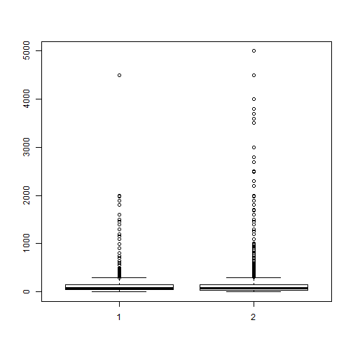
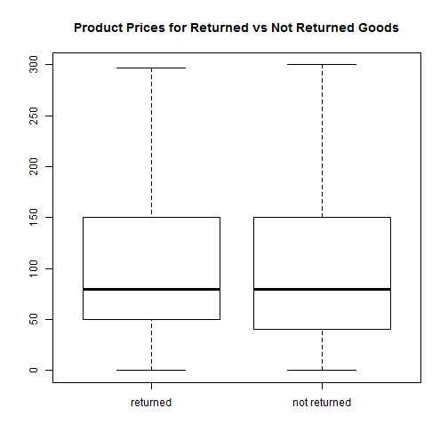

<style>
.midcenter {
    position: fixed;
    top: 50%;
    left: 50%;
}
.small-code pre code {
  font-size: 1em;
}
.smaller-code pre code {
  font-size: 0.9em;
}
.smallest-code pre code {
  font-size: 0.6em;
}
.smallestest-code pre code {
  font-size: 0.55em;
}
.big {
  font-size: 10em;
}
</style>


Welcome to BT1101.1
========================================================
author: 
date: 

Introductions Are In Order
========================================================
transition: fade
incremental: true

- Ken Oung
- Jun Weng
- Zhen Xuan
- Jin Wei
- Rhynade
- Selina
- Jian Sheng

Analytics, Schmanalytics
========================================================
transition: fade
incremental: true
- Descriptive Analytics
- Predictive Analytics
- Prescriptive Analytics

What To Expect
========================================================
transition: fade
incremental: true

- RStudio Basics
- Data Management
- Data Visualization
- Linear Regression

You're on your own for these
========================================================
transition: fade
incremental: true

- Statistical Analysis
- Logistic Regression
- Excel
- Unsupervised Learning

Getting Started
========================================================
transition: fade
title: false

<div class="midcenter" style="margin-left:-112.5px; margin-top:-112.5px;">
</img>
</div>

Importing Data
========================================================
incremental: true


Sorting by Groups


dmef_small[, PRICE := EXT_PRICE/QUANTITY]
```

```r
object.price <- dmef_small[, .(PRODUCT_NO, PRODUCT_CATEGORY_ID, PRICE)]
```

```r
unique(object.price, by = c("PRODUCT_NO", "PRICE"))
```

```r







```
Error in setwd("~/R Intro/bza-r-intro/code") : 
  cannot change working directory

class:small-code


incremental:true
- Linearity
- Normality
- Homoscedasticity
- Independence of Errors (time series)


Drawing Lines
========================================================
class:smaller-code
```


Multicollinearity
========================================================
incremental:true

```r
library(car)
durbinWatsonTest(fit_final)
```

```
 lag Autocorrelation D-W Statistic p-value
   1      0.06134832      1.796144   0.438
 Alternative hypothesis: rho != 0
```

```r
vif(fit_final)
```

```
      wt       am  log(hp) 
3.806564 2.108117 2.250186 
```


