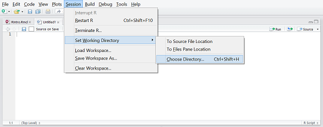
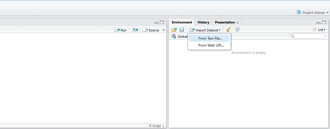

# Introductory Data Munging in R
## First things first: RStudio

First off, we'll run through the installation of RStudio for those of you who have yet to download and install. You'll be needing R, which you can find here:

[Click here to download R](https://cran.rstudio.com/)

Next, you'll need RStudio, which is a GUI for using R:

[Click here to download RStudio](https://www.rstudio.com/products/rstudio/download2/)

R is a language used mainly for statistical analysis. It is easily extendible through packages that can be downloaded and installed from the R-repository. To access this repository and install pacakges, use the ```install.packages("Package Name")``` function.

For today, you will be needing the following packages:

```install.packages(data.table)```
```install.packages(car)```

Another package that is useful to have is the swirl tutorial package:

```install.packages(swirl)```

This package includes tutorials into the different classes and functions of R, and will be a useful reference for getting started with R. However, we will not be covering this, snce you can slowly explore this in your free time. While useful, going through the Swirl tutorials can be time consuming.

If at any point in time you are confused about a function in R, you can use the command ```?<function>``` to find out more about the function. For example:

```?install.packages```

## Importing Data
### Setting your working directory in RStudio
We'll be using a DMEF dataset, which is mostly online shopping data (some phone and mail transactions too). Let's import the data first. If you're using RStudio, both navigating to the working directory and importing the file can be performed using the GUI, and the code will be generated for you.



### Importing a file using RStudio
The read.csv function takes in a csv file and imports it into R. If the file is in your working directory, you will only need the name of the file. If you are trying to import the file from another folder, as shown below, you will need to specify the file path.



The '<-' operator is used to store data in a variable. 
```{r}
# Navigating to your working directory (GUI)
setwd("C:/Users/Ken/Dropbox/Academics/2016/Sem2/R Intro/bza-r-intro/code")
#setwd("~/R Intro/bza-r-intro/code")

# Loading the file (GUI)
dmef_dataset <- read.csv("C:/Users/Ken/Dropbox/Academics/2016/Sem2/R Intro/bza-r-intro/data/dmef_dataset.csv")
#dmef_dataset <- read.csv("~/R Intro/dmef_dataset.csv")
```

So the code above loads the csv data and saved it to the 'dmef_dataset' variable.

## Getting A Feel
You can take a look at the entire dataset using the View command, ```View(dmef_dataset)```, get a simple summary using the summary command, ```summary(dmef_dataset)```, or see the types of data being stored using the str command, ```str(dmef_dataset)```. 

Let's just use the summary command to see the descriptive statistics for this dataset.

```{r}
summary(dmef_dataset)
```

## Before we go on...

The data that you have currently imported is in a data.frame format. This is the most primitive and basic class for storing data in R. To check this, you can use the class function:

```{r}
class(dmef_dataset)
```


Personally, I like using the **data.table** library. This is an extension of the data.frame class and allows you to manipulate the dataset more easily. You have other options like the standard in-built **data.frame** object, or **dplyr** which works better with ggplot2, but data.table is the one we'll be working with today.

```{r}
# Firstly, let's load the data.table package that you installed earlier.
library(data.table)

# Making the dataframe a datatable
dmef_dataset <- as.data.table(dmef_dataset)
```

Now, you can check the class of the dataset:

```{r}
class(dmef_dataset)
```

As you can see, the data set now has the class "data.table", but it is still a data frame. This is because data table is only an extension of the data frame class. We won't go into too much specifics at this point, so let's continue.

## WTF so many columns

If you've taken a look at the full data set, you might think it's a little large to handle. So let's clean up and filter the data. This is where the data table comes in useful. Let's run through some of the basic functions of a data table that might help.

The data table function takes the general form of data.table(x,y,z), where x denotes the subset of rows, y denotes the subset of columns, and z denotes the grouping criteria for the resultant column. Let's say we want to look at rows 3 to 5

### Sifting through rows

```{r}
dmef_dataset[3:5,]
```

But that doesn't really help with data analysis, since you won't know which rows you are interested in, and you definitely do not want to search through all those rows. Luckily, R can also do that for you. Data tables allow for sorting of values based on the row. Let's try that now. For this, we can for example find the rows that contain a certain product...

```{r}
# To keep it short, let's use the head function to look at the first five entries.
head(dmef_dataset[PRODUCT_NO %in% 987668])
```

Or maybe we want to look at a few products at a time. To do this, we will create a vector of the products we want using the ```c()``` function.

```{r}
head(dmef_dataset[PRODUCT_NO %in% c(987668, 989457)])
```

The first variable in the data.table function can take in any argument. We can include filters to check for specific values, as we have done above, but we can also filter out values outside of a certain range. For example:

```{r}
head(dmef_dataset[EXT_PRICE < 30])
```

We can even throw all of the above together!

```{r}
head(dmef_dataset[EXT_PRICE<70 & PRODUCT_NO %in% c(987669, 989457)])
```

### Sorting columns

data.tables also allow you to filter out columns using their headers. For example, let's take a look at some products and their cost and price.

```{r}
ex1 <- dmef_dataset[,.(PRODUCT_NO, QUANTITY, EXT_PRICE)]
```

You can also generate new columns ased on data from existing columns, similar to what you can normally do in excel, but this time with one line of code. The ```EXT_PRICE``` column takes into account the total price of all the products. So lets try to find the the unit price of each product.

```{r}
#We start by removing duplicate products. The following code removes duplicates from the dataset using the product numbers as a key.

unique_ex1 <- unique(ex1, by = "PRODUCT_NO")

#Next, we'll create a new column called unit_price, and make it equal to the value of EXT_PRICE divided by QUANTITY.

unique_ex1 <- unique_ex1[, unit_price := EXT_PRICE/QUANTITY]

#To better see how the code works, let's take a look at the products with quantity greater than 1

head(unique_ex1[QUANTITY > 1])

```

###Sorting by groups

Lastly, let's look at how to sort the data by groups. For example, let's say we want to find out the sum of the prices for each product. Fo this, we designate the product numbers as the groupings. The code should look something like this:

```{r}
head(ex1[,.(total = sum(EXT_PRICE)), by = PRODUCT_NO])
```

As some of you may have realized, we could have used this to find the unit price of each product much more easily. Let's try and compare the results.

```{r}
head(ex1[,.(unit = sum(EXT_PRICE)/sum(QUANTITY)), by = PRODUCT_NO])
```
***
```{r}
head(unique_ex1)
```

Looks like there's a bit of discrepancy. While the reason may be obvious based on the different ways we approached this, let's try and confirm it with some code:

```{r}
ex1[PRODUCT_NO == 987668, .N, by = EXT_PRICE/QUANTITY]
```

The above code sorted product number 987668 into different categories based on the unit price calculated from each individual transacion. As you can see, there are 69 transactions at 79.95 each, 2 transactions at 59.95 each, and one poor soul who bought the product for 89.95 each. For our first method, we removed any duplicates before calculating anything, and the duplicates were calculated based on product number. Hence, the transactions with different prices were removed, and not counted in calculating the unit price. However, when we calculated it by grouping the product numbers and calculating the overall average, these different prices were taken into account.

The important lesson here is to ensure that whichever method you use to extract data from a dataset, you should always besure that you are getting the correct values. It always helps to find out alternative methods of extracting the same data, just to check if they correlate.

### Moving on, finally

Now that you know the basic functions for managing data in a data.table, let's carry on with our analysis. We'll start by removing the columns we don't care about. The ```dmef_small``` dataset we get will be used for the rest of this exercise.

```{r}
dmef_small <- dmef_dataset[, .(ORDER_NO, ZIP, ORDER_LINE, PRODUCT_CATEGORY_ID, 
                               CHANNEL, PRODUCT_NO, EXT_PRICE, QUANTITY, 
                               RETN_QTY, RETN_REVENUE)]
```

## Weird prices?
We can start doing some simple histograms to better understand the distribution of the data.

For example, let's make a histogram for price.

```{r}
# First I create a new col for price. EXT_PRICE = PRICE * QTY so to get price..
dmef_small[, PRICE := EXT_PRICE/QUANTITY]

# You should see a new column called PRICE
head(dmef_small)

# We want to see the distribution of prices for diff objs
# But in this case, each observation is a transaction
# This means there could be super popular objects that mess things up for us
# So first let's just get prices for unique products
object.price <- dmef_small[, .(PRODUCT_NO, PRODUCT_CATEGORY_ID, PRICE)]
```

Remember the mistake we made earlier when using the unique function, in leaving out different price groups for a product? Let's try to resolve that while using the unique function. We can do this by adding another variable to the unique function, so that it searches for rows that are unique both in price and product number.

```{r}
uniq.object.price <- unique(object.price, by = c("PRODUCT_NO", "PRICE"))
```

Now we're left with 8909 unique products with unique prices to look at. Next, let's plot them on a histogram. The histogram function is simply ```hist(data table)```. There are additional parameters you can define, and you can find out more by typing ```?hist()``` into your console. For now, we will be using ```main``` to determine the name of the histogram, and ```xlab``` to label the x-axis.

```{r}
# Plot prices on a histogram
hist(uniq.object.price[, PRICE],
     main = "Histogram of all prices",
     xlab = "Price")
```

Can't really see much...let's filter to those cheaper than 100. Then, to ensure that we can see the prices more easily, we'll use ```break``` to specify for the histogram to show a hundred bars. This way, each bar will represent a dollar across the x-axis. 

```{r}
hist(uniq.object.price[PRICE < 100, PRICE], breaks=100,
     main = "Histogram of Prices below 100",
     xlab = "Price")
```

Looks like the prices bunch around certain values. Let's try to break this down, and look at the the ending number for the price. To do that, we define a function in r, which removes the decimal place, and then find the remainder when divided by 10, giving the ones place digit. After that, we'll add a new column for the ones place, and plot the histogram.

```{r, results='hold'}
LastDigit <- function(x) { (x - x%%1) %% 10 }

# Add a new col ONES.PLACE

uniq.object.price[, ONES.PLACE := LastDigit(PRICE)] 

hist(uniq.object.price[, ONES.PLACE],
     main = "Histogram of Ones Place",
     xlab = "Ones Place")

#Now, let's look at the cents portion. Again, we'll define a function for the cents part.

Cents <- function(x) { round(100 * (x %% 1)) }

#Creating a column for the cents.
uniq.object.price[, CENTS := Cents(PRICE)]

#We'll plot a Histogram with the same paramenters as before
hist(uniq.object.price[, CENTS], breaks=100,
     main = "Histogram of Cents Portion",
     xlab = "Cents")

# Wow okay looks like there's not much variation
# How about the exact numbers?
table(uniq.object.price[, CENTS])
```

## Lol is this even helpful?
I mean, the prices thing sounds interesting and all, but can we derive any cool business insights using R? 

Actually, that last part was just a warm-up. Retail businesses can sometimes have problems with high return rates. Wouldn't it be useful if we could find out more about why products were being returned? Let's try finding out the proportion of returns for each product category, as well as the distribution of returned products.

## Return vs Non-return
First let's split the dataset.

```{r}
# Split into two groups
returned <- dmef_small[RETN_QTY > 0]
not.returned <- dmef_small[RETN_QTY == 0]

# Checks to make sure we're right
table(dmef_small[, RETN_QTY==0])

# This should match up with our number of rows
nrow(returned)
nrow(not.returned)

# Yup looks like it worked, and about 4.75% of all goods were returned?
nrow(returned)/nrow(dmef_small) * 100
```

### Price
Since we've been looking at price so much, was there a difference in the prices of products that were returned vs not returned? Remember we did a quick price sorting earlier, under ```unique.object.price```. We'll use the ```returned``` and ```not.returned``` dataset to filter out the products from the 

```{r}
returned.object.price <- uniq.object.price[PRODUCT_NO %in% returned[, PRODUCT_NO]]
not.returned.object.price <- uniq.object.price[PRODUCT_NO %in% not.returned[, PRODUCT_NO]]
```

Now, we'll introduce you to another type of plot you'll encounter quite often: the box plot. The box plot shows the distribution of the dataset, with the center line representing the mean, the top and bottom of the box representing the 25th and 75th percentile respectively. Additional points outside the box represent outliers. Since a box plot is used to compare distributions, it takes in two data vectors. As usual, to find out more you can type ```?boxplot``` into your console.

```{r}
# Any difference in price distribution?
boxplot(returned.object.price[, PRICE],not.returned.object.price[, PRICE])
```

Well clearly there are too many outliers. Let's ignore the outliers.

```{r}
boxplot(returned.object.price[, PRICE],not.returned.object.price[, PRICE],
        main = "Product Prices for Returned vs Not Returned Goods",
        names = c("returned", "not returned"),
        outline=F)
```

Well for the prices, it appears that median price is about the same for both, but products that are returned don't go as expensive as those that are returned. You can tell from a lower 75th percentile, and lower max (excluding outliers). Of course, it's also possible that you observe because of a greater variance. There are after all about 2.7x the number of unique products in the not returned list vs the returned list.

### Total Order Size
Instead of just looking at object price, how about the total spent in that transaction, ```(EXT_PRICE)```?

```{r}
boxplot(returned[, EXT_PRICE], not.returned[, EXT_PRICE], outline=F,
        main = "Extended Prices for Returned vs Not Returned Goods",
        names = c("Returned", "Not Returned"))
```

Interestingly, after accounting for outliers, it appears that returned goods tend to be in larger orders than non-returned goods. This might indicate that customers who make larger purchases tend to return goods more, or that customers who like to return goods tend to buy more.

### Product Categories
Now, let's take a look at which product categories tend to have the highest rate of returns. Firstly, we'll use a bar plot to show the proportion of returned goods that came from that product category. Let's sort the data by getting the count of returned goods per product category. 

```{r}
bar1 <- returned[, .N, by = PRODUCT_CATEGORY_ID]

#Now, let's plot the bar chart using the product counts.

barplot(bar1[,N], names = bar1[,PRODUCT_CATEGORY_ID])
```

Next, we will do the same for non-returned goods.

```{r}
#We'll do the same conversion as we did with the returned goods.
bar2 <- not.returned[, .N, by = PRODUCT_CATEGORY_ID]

#The same goes for the bar plot.
barplot(bar2[,N], names = bar2[,PRODUCT_CATEGORY_ID])
```

When trying to compare data using bar plots, it helps if we can do an overlay to see their distributions with respect to each other, especially when the order of the bars are sorted. Let's try that.

Firstly, you'll realize that product category I has never been returned, and hence does not show up in the original. We'll just fix that by adding in an empty row for I, using the ```rbind``` function. Next, we'll sort both tables based on their product category in alphabetical order.

```{r}
#We'll start by sorting both the datasets based on the product category
bar1 <- rbind(bar1, data.table(PRODUCT_CATEGORY_ID = "I", N = 0))
bar1 <- bar1[order(PRODUCT_CATEGORY_ID)]
bar2 <- bar2[order(PRODUCT_CATEGORY_ID)]
```

The ```order()``` function sorts the rows in a data table based on the specified column. In this case, the table is now sorted in ascending alphabetical order based on the product category ID. To sort it in descending order, you can simply use ```order(-PRODUCT_CATEGORY_ID)``` instead

Next we'll plot the bar charts in an overlay. We'll also add in a legend for clarity.

```{r, results="hold"}
barplot(bar1[,N], names = bar1[,PRODUCT_CATEGORY_ID], border = "darkblue", col = "darkblue",  density = 20, 
        ylim = c(0, max(dmef_small[, .N, by = PRODUCT_CATEGORY_ID][,N])))
par(new=TRUE)
barplot(bar2[,N], names = bar2[,PRODUCT_CATEGORY_ID], border = "red", col = "red", density = 20, 
        ylim = c(0,max(dmef_small[, .N, by = PRODUCT_CATEGORY_ID][,N]))) 
legend("top", legend = c("Returned", "Not Returned"), fill = c("darkblue", "red"))
```

Perhaps the numbers are to large to actually get a better picture of proportion. Let's try a stacked bar plot, which also happens to be easier. We'll start by merging the datasets

```{r}
bar <- bar1[,.(bar1[,N], bar2[,N])]

#Next, we'll convert it to a matrix and invert it, and just insert it into the barplot function

bar <- as.matrix(t(bar))
barplot(bar, 
        names = bar2[,as.character(PRODUCT_CATEGORY_ID)],
        col = c("darkblue","red"), 
        ylim = c(0, max(dmef_small[, .N, by = PRODUCT_CATEGORY_ID][,N])))
legend("top", legend = c("Returned", "Not Returned"), fill = c("darkblue", "red"))
```

This all looks nice and stuff, but let's try to think what this chart means. Each barplot represents the distribution of returned and non-returned goods respectively. For example, we can see that products C, E, P and T were by far the most popular products based on volume of sales. However, take note of the small blue bars representing the number of returned goods for that product category. Although T has a marginally higher sales volume, C has a larger number of returned goods!

Let's break that information further into a more easily understandable format, and find out the percentage of goods returned for each product category.

```{R}
# Percentage of good returned in each product category
perc.returned.by.cat <- dmef_small[order(PRODUCT_CATEGORY_ID), .(Percentage.Returned=.SD[RETN_QTY>0, .N]/.N*100), by=PRODUCT_CATEGORY_ID]

#Plotting
barplot(perc.returned.by.cat[, Percentage.Returned], 
        names=perc.returned.by.cat[, PRODUCT_CATEGORY_ID],
        main = "Percentage of orders returned by category")
```

Not surprisingly based on the previous graph, we can see that product category C has the highest percentage of returns. However, another category we may have missed earlier is O, which is almost as high as C! Looking back, this would be because the overall sales volume of O was so low. 

## Regression

For this part, we'll be using a new dataset called mtcars. It's available in R's built-in base package. Retrieve it using the `data(mtcars)` and convert it to a ```data.table```.

```{r}
# Importing the data
data(mtcars)

library(data.table)
mtcars <- as.data.table(mtcars)
```
```{r, eval=FALSE}
# Find out more about this dataset
?mtcars
```

Using a multiple linear regression model, we want to investigate the fuel efficiency of cars by looking at their mpg (miles per gallon) rating. Let's see how each factor affects the mpg using the built in regression function in R.

```{r}
# Fit the model
fit <- lm(mpg ~ ., data = mtcars)
summary(fit)
```

By including all the variables, we get a decent model with an adjusted R-squared of 0.8066. However, we note that the p-values are all rather high. This indicates that the model can be improved by removing some of these regressors. We start by removing cyl which has the highest p-value.

```{r}
# Removing the regressor with the highest p-value
fit_no_cyl <- lm(mpg ~ . - cyl, data = mtcars)
summary(fit_no_cyl)
```

Note the improvement in adjusted R-squared. We repeat this until all our regressors have p-values below 0.05.

```{r}
fit_improved <- lm(mpg ~ wt + qsec + am, data = mtcars)
summary(fit_improved)
```

This process can actually be automated using the stepAIC function in the MASS package.

```{r}
library(MASS)
stepAIC(fit)
```

However, there are actually better models that you can obtain by applying some simple transformations. For example, let's take a look at the relationship between mpg and hp.

```{r}
plot(mtcars[, mpg], mtcars[, hp])
```

We can see there isn't a very distinct linear relationship, which can hurt our linear regression model. So let's apply a basic log transformation.

```{r}
plot(mtcars[, mpg], log(mtcars[, hp]))
```

And that looks significantly better. Let's try this new adjusted hp in this regression model. Using the same steps as before:

```{r}
fit_transformed <- lm(mpg ~ . - hp + log(hp), data=mtcars)
stepAIC(fit_transformed)

fit_final <- lm(mpg ~ wt + am + log(hp), data=mtcars)
summary(fit_final)
```

However, having a good fit for the regression model is not all that matters. You need to check if your four regression assumptions are met. The four assumptions include:

- normality
- homoscedasticity
- linearity 
- independence of errors (generally applies to time series data)

```{r}
# Regression Assumptions
plot(fit_final)
```

The first plot tests your assumptions for linearity and homoscedasticity. Firstly, if the red line is straight, then the assumption for linearity has been cleared. In this case, although the red line is not straight, we can see that this is due to a few outliers in the top right corner, while the bulk of the data points are roughly linear, and we can accept this. Secondly, we need to ensure that the variance between the data points are constant. Looking at this dataset, there data points appear evenly distributed and there is no distinct change in variance. Hence, the assumption for homoscedasticity is considered valid.

The second plot is used to test for normality. The regression assumes that the data points follow a normal distribution and if this is the case the data points on the QQ plot should closely align to the line on the chart. In this plot we can see that this is so and hence we can hold the assumption for normality.

The last chart measures Cook's distance, which is the acceptable range for outliers. the red dotted line at the corner measures limit for outliers, and since none of our data points reside outside that line, we can accept this regression model.

```{r}
library(car)
durbinWatsonTest(fit_final)
```

The last test is the test for independence of errors. This tends to be a significant problem with time series data, where yesterday's stock price has a high chance of affecting today's price. To test for this, we run the Durbin Watson test. As long as the Durbin Watson Statistic is between 1.5 and 2.5, the assumption for independence of errors is valid.

```{r}
# Check for multi-collinearity
# Anything below 10 is okay
library(car)
vif(fit_final)
```

Lastly, if two variables in your regression model are highly correlated, it can affect the outcome of your regression. Hence, we run the Variance Inflation Factor test to ensure that the variables used in your regression model are not correlated. As long as all of the vif values are less than 10, the regression model will hold.
